# Kubernetes Deploy

以下將以 CentOS 7 為例，佈建 kubernetes cluster

## 準備

* 4台 CentOS 7 Servers
  * 192.168.1.51  k8s-master
  * 192.168.1.52  k8s-node1
  * 192.168.1.53  k8s-node2
  * 192.168.1.54  k8s-node3

## 步驟

* 環境配置
* Kubernetes Cluster 配置
* 加入 Node 至 Cluster
* 測試第一個 pod
* Addons 部署

## 環境配置

首先要先進行環境的配置，在4台 CentOS 7 中執行以下步驟：

### Host 設定

編輯所有 Server 的 hosts 檔案

```sh
vim /etc/hosts
```

輸入以下內容

```sh
192.168.1.51  k8s-master
192.168.1.52  k8s-node1
192.168.1.53  k8s-node2
192.168.1.54  k8s-node3
```

### 關閉 SELinux

SELinux 是用來限制程式的存取權限，為了避免 kubernetes 權限問題，造成無法順利運作，因此將他關閉

```sh
setenforce 0
sed -i --follow-symlinks 's/SELINUX=enforcing/SELINUX=disabled/g' /etc/sysconfig/selinux
```

### 允許通過 FireWall

參考官網提供的 Required ports 如下

* Master Node

| Protocol | Direction | Port Range | Purpose                 | Used By              |
|----------|-----------|------------|-------------------------|----------------------|
| TCP      | Inbound   | 6443*      | Kubernetes API server   | All                  |
| TCP      | Inbound   | 2379-2380  | etcd server client API  | kube-apiserver, etcd |
| TCP      | Inbound   | 10250      | Kubelet API             | Self, Control plane  |
| TCP      | Inbound   | 10251      | kube-scheduler          | Self                 |
| TCP      | Inbound   | 10252      | kube-controller-manager | Self                 |

因為 etcd, kube-scheduler, kube-controller-manager 執行在同一台機器上，因此不需要特別打開，只需開啟 API Server 的 6443 及 10250 即可

```sh
firewall-cmd --permanent --add-port=6443/tcp
firewall-cmd --permanent --add-port=10250/tcp
firewall-cmd --reload
```

* Worker Node

| Protocol | Direction | Port Range  | Purpose             | Used By             |
|----------|-----------|-------------|---------------------|---------------------|
| TCP      | Inbound   | 10250       | Kubelet API         | Self, Control plane |
| TCP      | Inbound   | 30000-32767 | NodePort Services** | All                 |

上述的 30000-32767 為 Pod 預設使用的範圍，當 Pod 使用時，則需要將對應的 Port 打開，才能供外部存取. 而 kubelet 為接受 API Server 的指令需要的 Port 因此一定要打開.

```sh
firewall-cmd --permanent --add-port=10250/tcp
firewall-cmd --reload
```

### 啟用 br_netfilter Kernel Module

```sh
modprobe br_netfilter
echo '1' > /proc/sys/net/bridge/bridge-nf-call-iptables
```

### 關閉 SWAP

關閉 SWAP 並於啟動時關閉 SWAP

```sh
swapoff -a
vim /etc/fstab
```

註解 swap

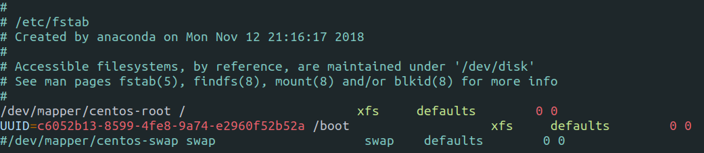

### 安裝 Docker CE

從 dokcer repository 安裝最新版本的 Docker-ce

安裝相依套件

```sh
yum install -y yum-utils device-mapper-persistent-data lvm2
```

將 docker repository 加入到系統中，並安裝 docker-ce

```sh
yum-config-manager --add-repo https://download.docker.com/linux/centos/docker-ce.repo
yum install -y docker-ce
```

啟動 docker，並設定開機自動啟動

```sh
systemctl start docker
systemctl enable docker
```

### 安裝 kubernetes

增加 kubernetes repository 至 CentOS 7 中

```sh
cat <<EOF > /etc/yum.repos.d/kubernetes.repo
[kubernetes]
name=Kubernetes
baseurl=https://packages.cloud.google.com/yum/repos/kubernetes-el7-x86_64
enabled=1
gpgcheck=1
repo_gpgcheck=1
gpgkey=https://packages.cloud.google.com/yum/doc/yum-key.gpg
        https://packages.cloud.google.com/yum/doc/rpm-package-key.gpg
EOF
```

執行安裝

```sh
yum install -y kubelet kubeadm kubectl
```

啟動 kubelet，並設定開機自動啟動

```sh
systemctl start kubelet
systemctl enable kubelet
```

### 修改 cgroup-driver

讓 Docker-ce 與 kubernetes 在同一個 `cgroup` 中

```sh
sed -i 's/cgroup-driver=systemd/cgroup-driver=cgroupfs/g' /etc/systemd/system/kubelet.service.d/10-kubeadm.conf
```

重新啟動系統及 kubelet

```sh
systemctl daemon-reload
systemctl restart kubelet
```

## Kubernetes Cluster 配置

接下來進行 kubernetes master 初始化

```sh
kubeadm init --apiserver-advertise-address=192.168.1.51 --pod-network-cidr=10.244.0.0/16
```

* --apiserver-advertise-address 為 API server 執行的位址，一般來說在 kubernetes master 上
* --pod-network-cidr 指定 pod 網路的 IP 範圍，稍候將使用 flannel 配置整個 pod 網路. 當然也可以使用其他像 weave-net 或 calico 等進行配置

_注意：當進行 kubeadm init 時，出現 unsupported docker version 時，代表 docker 版本太新，需要將 docker 進行降版_.

```sh
# 列出可用的 docker 版本
yum list docker-ce.x86_64 --showduplicates | sort -r
# 降至 18.06.1
yum downgrade docker-ce-18.06.1.ce-3.el7
# 若出現衝突，移除衝突的版本
yum erase docker-ce-cli-1:18.09.0-3.el7.x86_64
# 再次安裝
yum install docker-ce-18.06.1.ce-3.el7
# 重新啟動 docker 並設定開機啟動
systemctl start docker && systemctl enable docker
```

成功配置完成將顯示

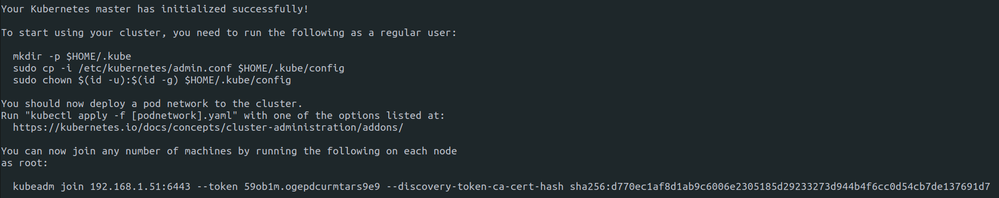

請複製 `kubeadm join ...` 到其他文字編輯器中，稍候將會使用此指令將 Node 加入 Cluster

接下來進行 Kubernetets 的配置，新增 `.kube` 資料夾，並複製 `admin.conf` 設定檔

```sh
mkdir -p $HOME/.kube
sudo cp -i /etc/kubernetes/admin.conf $HOME/.kube/config
sudo chown $(id -u):$(id -g) $HOME/.kube/config
```

### flannel 網路配置

佈署 flannel 網路

```sh
kubectl apply -f https://raw.githubusercontent.com/coreos/flannel/master/Documentation/kube-flannel.yml
```

等待片刻後，使用以下指令檢查 kubernetes nodes 跟 pods 是否 `Ready` 及 `Running`

```sh
kubectl get nodes
kubectl get pods --all-namespaces
```

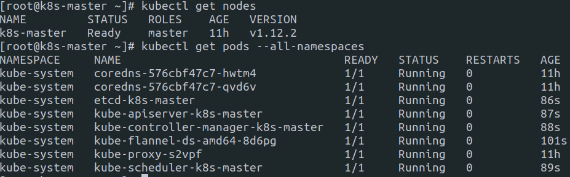

## 加入 Node 至 Cluster

接下來，加入 k8s-node1, k8s-node2, k8s-node3 至 cluster

### Node 配置

每一台 Node 皆需要依照前幾章節進行 `Host 設定`, `關閉 SELinux`, `啟用 br_netfilter Kernel Module`, `關閉 SWAP`, `安裝 Docker CE` 及 `安裝 kubernetes`

_注意：Docker 版本是否太新_.

### 加入 Node

於所有 Node 執行，剛剛複製下來的 `kubeadm join ...` 指令

```sh
kubeadm join 192.168.1.51:6443 --token 59ob1m.ogepdcurmtars9e9 --discovery-token-ca-cert-hash sha256:d770ec1af8d1ab9c6006e2305185d29233273d944b4f6cc0d54cb7de137691d7
```

全部加入後，稍待片刻，所有 Node 將變成 `Ready` 狀態

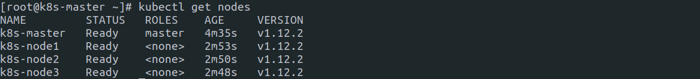

有的時候想將新的 Node 加入到已經存在的 Cluster 中

在 Master 上執行

```sh
kubeadm token create --print-join-command
```

將會再次顯示新的 token 與 discovery-token-ca-cert-hash，執行該指令到新的 Node 上，將成功加入新的 Node 到已存在的 Cluster 上

## 測試第一個 pod

到目前為止已經把 kubernetes Cluster 建立起來了，當然還有更多更豐富的插件可以使用例如使用 Dashboard 進行 Node 與容器的監控等，將在下一個章節說明.

這裡首先我們來建立第一個 pod 證明剛剛花了很多功夫建立起來的 Cluster 可以使用. 簡單地建立一個 nginx 的 deployment

```sh
kubectl create deployment nginx --image=nginx
```

接著查看部署情況

```sh
kubectl get all
```

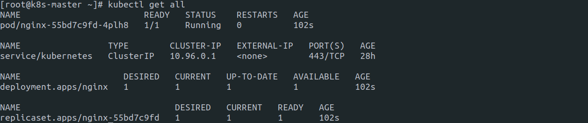

嗯... 看起來有正確的在執行，那我們要如何透過網頁連上 nginx 呢？
透過建立一個 service NodePort 來曝露 nginx

```sh
kubectl create service nodeport nginx --tcp=80:80
```

接著觀察是否正常運行

```sh
kubectl get pods
kubectl get svc
```

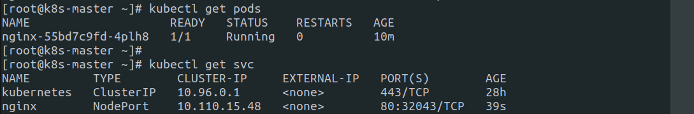

可得知 nginx 執行在 Cluster IP 10.110.15.48:80 上，也可以透過 Master 和 Node IP 192.168.1.5x:32043 去訪問

```sh
curl k8s-master:32043
curl k8s-node1:32043
curl k8s-node2:32043
curl k8s-node3:32043
```

竟然可以在任何一台上進行存取，是多麼的神奇！
若本機不在 kubernetes Cluster 中，也可以透過 SSH Tunnel 到任何一台中，再透過瀏覽器進行存取

```sh
ssh -L32043:k8s-node1:32043 <k8s-master@address>
```

## Addons 部署

### Dashboard

Dashboard 為官方開發的是視覺化儀表板，讓人可以直接透過網頁看到整個 Cluster 的資源變化，提升管理便利性.

在 k8s-master 執行以下指令

```sh
kubectl apply -f https://raw.githubusercontent.com/kubernetes/dashboard/master/src/deploy/recommended/kubernetes-dashboard.yaml
```

接著使用以下指令觀察 dashboard 是否正確部署

```sh
kubectl get all -l k8s-app=kubernetes-dashboard -n kube-system -o wide
```

* **-l k8s-app=kubernetes-dashboard** 使用指定的 label 進行過濾
* **-n kube-system** 切換至指定的 namespace
* **-o wide** 顯示更詳細的資訊

應該看到如下圖，pod 為 `Running`, 且其他元件的 `CURRENT` 與 `DESIRED` 相符

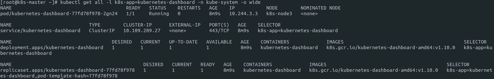

_注意：若發現 pod 為 CrashLoopBackOff 狀態，可試著將 Master 及所有 Node 的防火牆關閉_.

```sh
systemctl stop firewalld && systemctl disable firewalld
```

部署完成後，執行以下指令

```sh
kubectl proxy
```

隨即能存取 Dashboard

```txt
http://localhost:8001/api/v1/namespaces/kube-system/services/https:kubernetes-dashboard:/proxy/
```

_若想在其他裝置進行存取，建議使用 SSH 進行 Tunnel_.

```sh
ssh -L8001:localhost:8001 <k8s-master@address>
```

使用瀏覽器開啟後，可能會看到各種禁止存取

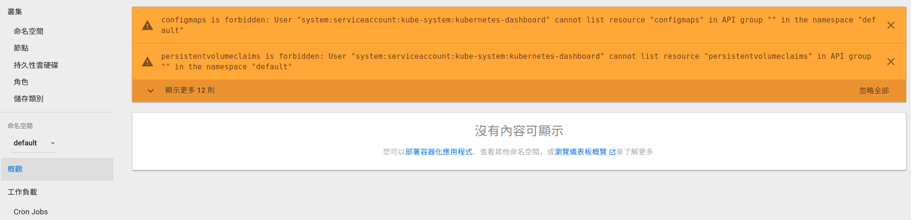

或者

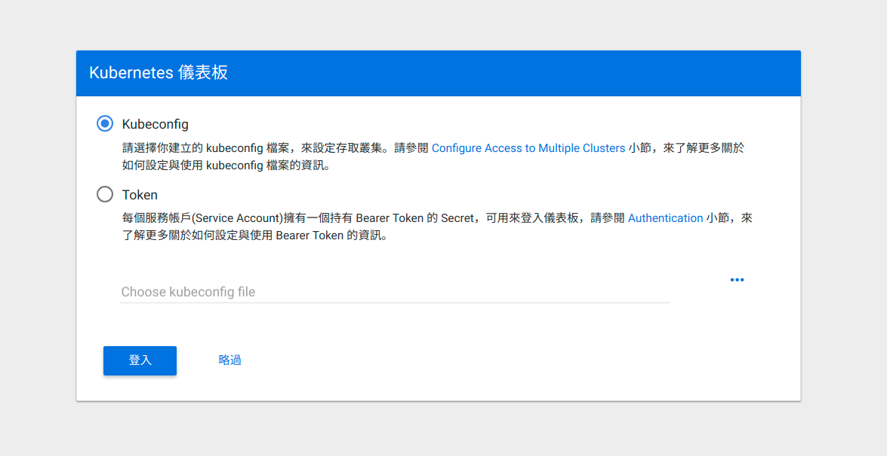

接著我們需要透過 kubeconfig 或 Service Account 進行登入，目前先建立一個 Service Account 快速測試，畢竟有畫面才有真實感，稍候將描述如何針對不同 User 開啟對應權限

建立 Service Account，並產生 token

```sh
kubectl -n kube-system create sa dashboard
kubectl create clusterrolebinding dashboard --clusterrole cluster-admin --serviceaccount=kube-system:dashboard
SECRET=$(kubectl -n kube-system get sa dashboard -o yaml | awk '/dashboard-token/ {print $3}')
kubectl -n kube-system describe secrets ${SECRET} | awk '/token:/{print $2}'
```

將產生的 token 貼到 Kubernetes dashboard

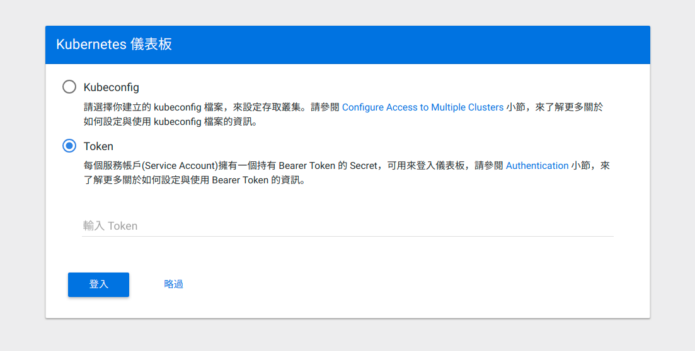

接著就能真的看到資源的分配情況，終於有點真實感了

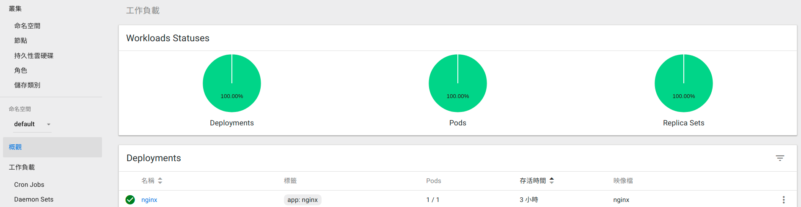

### Kubernetes Reset

以下為重新設定 kubernetes 的指令，將會移除 kubelet 的網路配置

```sh
kubeadm reset
systemctl stop kubelet
systemctl stop docker
rm -rf /var/lib/cni/
rm -rf /var/lib/kubelet/*
rm -rf /etc/cni/
rm -rf ~/.kube
ip link delete cni0
ip link delete flannel.1
systemctl start docker && systemctl start kubelet
```

